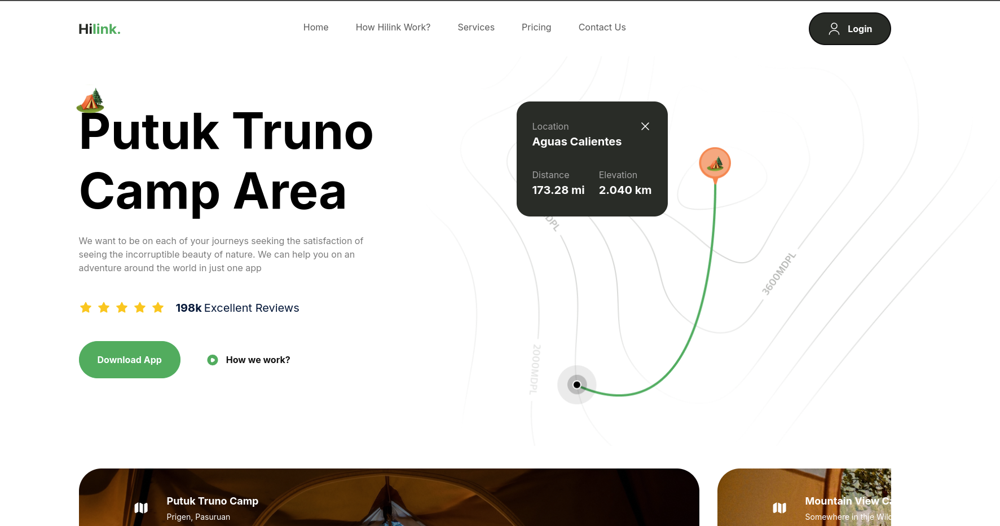

<h1 align="center">
  
</h1>

<h3 align="center">
  Hilink Page
</h3>

<p align="center">
  

  

  
  <a href="https://github.com/mlg404/hilink-travel-landing-page/commits/main">
    
  </a>

  <a href="https://github.com/mlg404/hilink-travel-landing-page/issues">
    
  </a>
</p>
<p align="center"><a href="https://www.buymeacoffee.com/mlg404"></a></p>

<p align="center">
  <a href="#rocket-info">Info</a>&nbsp;&nbsp;&nbsp;|&nbsp;&nbsp;&nbsp;
  <a href="#computer-technologies">Technologies</a>&nbsp;&nbsp;&nbsp;|&nbsp;&nbsp;&nbsp;
  <a href="#information_source-how-to">How to</a>&nbsp;&nbsp;&nbsp;|&nbsp;&nbsp;&nbsp;
</p>

## :rocket: Info

This is a web page to train my Tailwind and Next.js skills. It's a simple landing page for a travel agency.
Tutorial available at [Javasciprt Mastery Youtube Channel](https://www.youtube.com/watch?v=cuzw4vL1z5E).

## :computer: Technologies

This project was developed following this technologies:

- [Node.js](https://nodejs.org/en)
- [Next.js](https://nextjs.org/)
- [Tailwind](https://tailwindcss.com/)
- [VS Code][vc]
- [Typescript](https://www.typescriptlang.org/)
- [Biomejs](https://biomejs.dev)

## :information_source: How To

To clone this application you will need [Git](https://git-scm.com). Run in terminal:

```bash
##### Clone this repo #####

# https
$ git clone https://github.com/mlg404/hilink-travel-landing-page.git

##### Access this repo #####
$ cd hilink-travel-landing-page

##### Install dependencies #####
$ npm install

##### Run the application #####
$ npm run dev
```

After that, just choose your favorite Browser client and open `http://localhost:3000`.

---

Made with 💙 by Victor Eyer :wave: [Get in touch!](https://www.linkedin.com/in/victoreyer/)

[vc]: https://code.visualstudio.com/
